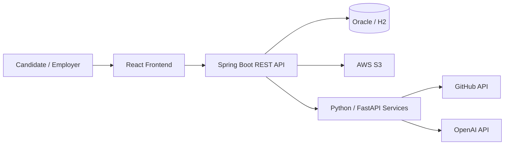

# ZOOP — AI-Powered Recruiting Platform

<div align="center">
  

  [](https://react.dev/)
  [](https://spring.io/projects/spring-boot)
  [](https://openjdk.org/)
  [](https://www.python.org/)

  **A full-stack recruiting platform that combines GitHub analytics, AI-assisted interviews, and portfolio-to-job matching.**

  [English Presentation](https://drive.google.com/file/d/1-5ybBe50r1s6Oom1Vlb1Wb0mai9e6vrY/view?usp=sharing) ·
  [Korean Presentation](https://drive.google.com/file/d/1VE9tTy6UxbMjZI4V_2zuv2BueVTo3uRG/view?usp=sharing)
</div>

## Overview

ZOOP connects software candidates and employers through an explainable, data-driven recruiting workflow. The platform analyzes GitHub activity, ranks candidates against role requirements, generates tailored interview questions, evaluates interview responses, and matches portfolios to job descriptions.

The project was developed by a **4-person team** as a Korea Software Industry Association (KOSA) capstone project from **June to August 2025** and received the **KOSA Excellence Award**.

## Project Results

- Processed **100+ candidate profiles** for ranking, portfolio-to-JD matching, and interview automation.
- Generated **500+ tailored interview questions**, with at least five questions produced per candidate.
- Reduced estimated first-round screening effort by **90%** by replacing resume-by-resume triage with AI-ranked candidate shortlists.
- Delivered an integrated workflow spanning the React frontend, Spring Boot application server, Python AI services, relational databases, and object storage.

## Core Features

### Candidate Experience

- GitHub account analysis and automated portfolio generation
- Personalized job recommendations based on skills and activity
- AI-assisted interviews with text-to-speech prompts and browser-based recording
- Portfolio, application, and interview schedule management

### Employer Experience

- Job posting and interview schedule management
- Candidate ranking based on GitHub activity, language distribution, contribution signals, and role requirements
- Candidate portfolio and technical-profile review
- AI-generated interview questions and answer analysis

### AI Services

- **GitHub analysis:** extracts repository activity, languages, contribution signals, and portfolio evidence
- **Interview question generation:** creates role- and candidate-specific questions
- **Interview analysis:** evaluates answer content and produces structured feedback
- **Portfolio matching:** compares candidate experience with job-description requirements
- **Evidence-first matching:** returns dimension scores, source-backed evidence, confidence, missing evidence, and interview follow-up topics instead of an opaque single score.
- **Support assistant:** routes customer questions through the server-side AI service; no OpenAI credential is shipped to the browser.

### What makes the AI different

ZOOP is designed around a **decision that can be challenged**, not a score that must be trusted blindly:

- **Evidence ledger:** every portfolio and GitHub analysis separates claims, source, confidence, gaps, and verification actions. Portfolio quotes are mechanically checked against the submitted text before they are labeled as verified.
- **Counterfactual matching:** recruiters can select missing signals—such as confirming a candidate's actual project contribution—and preview how that evidence could change the recommendation.
- **Interview consistency audit:** interview analysis checks whether claims remain consistent across answers and links observations back to answer-level quotes.
- **Decision receipt:** a recruiter can export the score, evidence, fairness guard, uncertainty, and next verification steps as an auditable JSON receipt.
- **Fairness guardrails:** names, gender, age, photos, school, location, and other non-job-related attributes are explicitly excluded from the AI evaluation contract.

The result is an AI recruiting workflow that makes uncertainty visible and turns it into the next best question, instead of hiding uncertainty behind a polished ranking.

## System Architecture



The Spring Boot backend owns authentication, authorization, recruiting workflows, and persistence. Independent Python services handle GitHub analysis, interview generation and evaluation, portfolio matching, and other AI workloads.

## Technology Stack

| Layer | Technologies |
|---|---|
| Frontend | React 19.1, React Router, Tailwind CSS, styled-components, Recharts, Web Speech API, MediaRecorder API |
| Backend | Java 17, Spring Boot 3.4.5, Spring Security, JWT, Spring Data JPA, Spring WebFlux |
| AI Services | Python, FastAPI, OpenAI API, GitHub API |
| Data & Storage | Oracle Database, H2, AWS S3 |
| Tooling | Docker, Maven, npm, Git |

## Repository Structure

```text
zoop.kr/
├── frontend/
│   ├── public/
│   ├── src/
│   │   ├── components/
│   │   ├── pages/
│   │   │   ├── candidate/
│   │   │   ├── company/
│   │   │   └── info/
│   │   ├── context/
│   │   ├── api/
│   │   └── utils/
│   └── package.json
├── backend/
│   ├── src/main/java/com/zoop/backend/
│   │   ├── controller/
│   │   ├── service/
│   │   ├── repository/
│   │   ├── domain/
│   │   └── config/
│   ├── python-api/
│   │   ├── chatbot/
│   │   ├── github_search/
│   │   ├── interview_analysis/
│   │   ├── portfolio_matching/
│   │   └── interview_questions/
│   └── pom.xml
└── README.md
```

## Getting Started

### Prerequisites

- Node.js 18+
- Java 17+
- Python 3.8+
- Maven or the included Maven wrapper
- A configured relational database
- Git

### 1. Clone the Repository

```bash
git clone https://github.com/mck0124/zoop.kr.git
cd zoop.kr
```

### 2. Run the Frontend

```bash
cd frontend
npm install
npm start
```

The development server runs at `http://localhost:3000`. Copy `frontend/.env.example` to a local environment file and set `REACT_APP_API_URL` plus the Python service URLs for the services you run.

### 3. Run the Spring Boot Backend

Configure the database connection and required credentials in your local Spring configuration, then run:

```bash
cd backend
./mvnw spring-boot:run
```

The backend runs at `http://localhost:8081` by default.

### 4. Run the Required AI Services

AI services are located under `backend/python-api`. Install the dependencies for the service you need and run its entry point from the corresponding directory.

```bash
cd backend/python-api/<service-directory>
pip install -r requirements.txt
python <service-entry-point>.py
```

Keep API keys and other credentials in local environment variables or untracked configuration files. Do not expose OpenAI or database credentials in frontend code.

### Environment configuration

- Frontend: `frontend/.env.example` contains public service URLs only.
- Spring Boot: `backend/.env.example` contains required server-side secrets.
- Python AI services: `backend/python-api/.env.example` contains the OpenAI key and allowed browser origins.

Production configuration must provide real values for every required `${...}` variable in `application-prod.yml`; the repository intentionally contains no fallback credentials.

## Representative API Areas

| Area | Example Responsibilities |
|---|---|
| Authentication | Sign-up, login, logout, JWT-based authorization |
| Candidates | Job recommendations, portfolios, applications, interviews |
| Employers | Job postings, candidate review, interview scheduling |
| GitHub Analysis | Repository and contribution analysis, candidate ranking |
| AI Interviews | Question generation, recording workflow, answer analysis |
| Portfolio Matching | Candidate portfolio and job-description comparison |

## Presentations

- [View the English presentation](https://drive.google.com/file/d/1-5ybBe50r1s6Oom1Vlb1Wb0mai9e6vrY/view?usp=sharing)
- [View the Korean presentation](https://drive.google.com/file/d/1VE9tTy6UxbMjZI4V_2zuv2BueVTo3uRG/view?usp=sharing)

## Recognition

**KOSA Excellence Award (2025)** — awarded for the project's innovation and technical execution.

## Contributors

ZOOP was developed as a four-person KOSA capstone project. Contributions covered frontend development, backend architecture, AI-service development, data modeling, and deployment integration.

---

For questions or technical discussion, use the repository's [GitHub Issues](https://github.com/mck0124/zoop.kr/issues).
